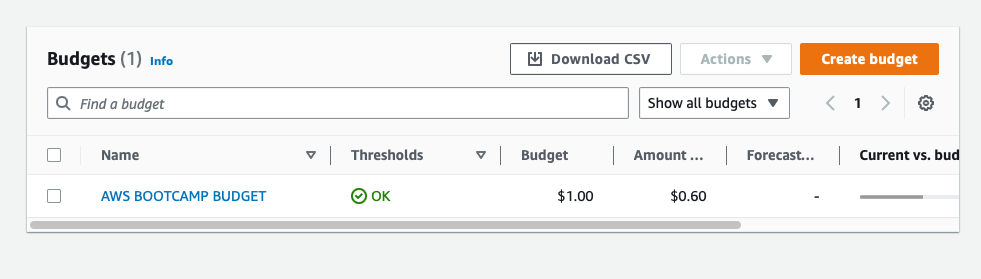

# Week 0 — Billing and Architecture
### Install and Verify AWS CLI 
Was  successfully able to use Gitpod or Github codespaces, prove below 

### Create a Budget

### Recreate Logical Architectural Deisgn

link - https://lucid.app/lucidchart/2efbdc66-61d7-43ab-8259-82bddb3ff1e9/edit?viewport_loc=-112%2C-920%2C2114%2C1227%2C0_0&invitationId=inv_7b7092d0-fd2a-452c-b3b4-41c99b550444

### Recreate conceptual diagram

link - https://lucid.app/lucidchart/fa1d1d92-019a-40cf-af1f-7eb668d6f79b/edit?viewport_loc=-370%2C-152%2C3184%2C1848%2C0_0&invitationId=inv_1e089833-5c62-4c30-8199-4946ab4aaa84
